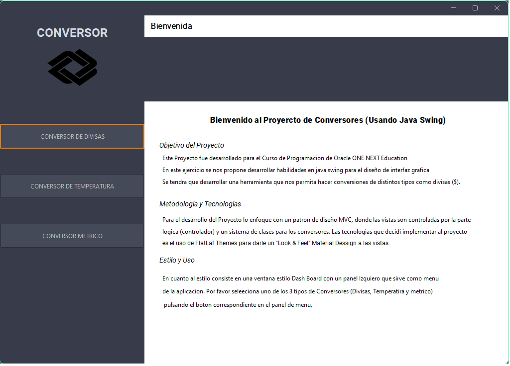

<h1>Conversor_ChallengeONE</h1>

<h2>Descripción</h2>

Conversor_ChallengeONE es una aplicación Java a manera de DashBoard con vistas SWING que permite a los usuarios convertir entre distintas divisas, temperaturas y unidades metricas. Para asegurar una experiencia fluida
  para el usuario, el programa utiliza un JPanel en el que se carga otro JPanel en el que se solicitan la cantidad, la divisa Origen y destino y sin necesidad de un boton muestra el resultado, aplicando para cada uno de
los conversores reutilizando el mismo codigo.

<h3>Conversor de divisas</h3>

El conversor de divisas nos ofrece la posibilidad de convertir de una divisa a otra entre las cuales estan Peso Mexicano (MXN) dólares estadounidenses (USD), euros (EUR), libras esterlinas (GBP), yenes japoneses (JPY) y wons surcoreanos (KRW) 

<h3>Conversor de temperaturas</h3>

El conversor de temperaturas nos ofrece la posibilidad de convertir unidades de temperatura (Celsius, Fahrenheit y Kelvin) utilizando la fórmulas de conversión.

<h3>Conversor metrico</h3>

El conversor de metrico nos ofrece la posibilidad de convertir unidades de temperatura (Metros, Centímetros, Milímetros, Pulgadas y Pies) utilizando la fórmulas de conversión.

<h2>Funcionalidades</h2>
<ul>
  <li>Menú principal estilo dashboard que permite seleccionar entre los conversores disponibles.</li>
  <li>Panel amigable para ingresar los datos del usuario</li>
  <li>Validación de entrada del usuario para asegurar que las cantidades ingresadas sean números válidos.</li>
</ul>

<h2>Estructura del código</h2>

El código utiliza un sistema de paquetes y clases y el patron de diseño es MVC, se delimita la parte logica que es la que controla todo el programa y lanza las vistas y recupera los datos ymuestra los resultados en tiempo real

